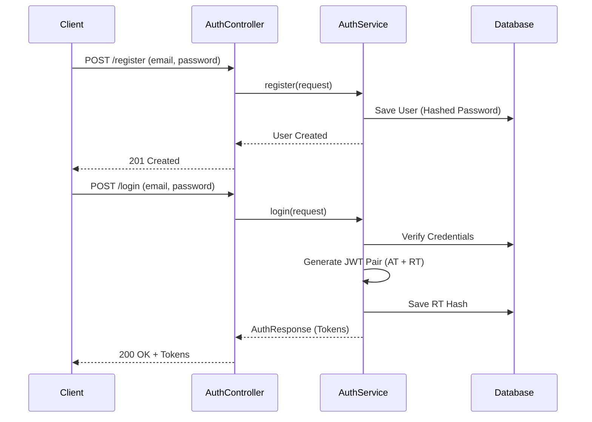
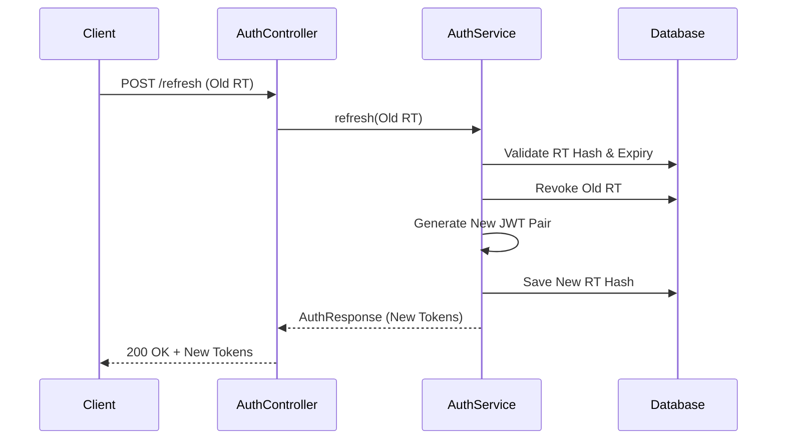

# Highload-Auth 🚀

A robust, production-ready Authentication & User Management service built with **Kotlin** and **Spring Boot**. Designed with high-load principles, featuring JWT-based security, refresh token rotation, and comprehensive observability.

---

## 🛠 Tech Stack

- **Language:** Kotlin 1.9.x
- **Framework:** Spring Boot 3.2.x
- **Security:** Spring Security (JWT-based)
- **Database:** PostgreSQL
- **Migrations:** Flyway
- **Documentation:** OpenAPI 3 / Swagger UI
- **Logging:** Logstash Logback Encoder (Structured JSON logging)
- **Containerization:** Docker & Docker Compose
- **Testing:** JUnit 5, Mockito, AssertJ, Testcontainers

---

## ✨ Features

- **Authentication Flow:**
    - Secure User Registration with password hashing (BCrypt).
    - JWT Login with Access and Refresh tokens.
    - **Refresh Token Rotation:** Every time a refresh token is used, a new pair is issued, preventing replay attacks.
    - **Token Revocation:** Logout and "Logout from all devices" functionality.
- **Security & Integrity:**
    - UUID-based primary keys for obfuscation.
    - Unique JWT IDs (`jti`) to ensure token uniqueness.
    - SHA-256 hashing for refresh tokens stored in the database.
- **Observability:**
    - Structured JSON logging for ELK compatibility.
    - Request ID tracking across filters and services.
    - Health checks endpoint.
- **Dev Experience:**
    - Version Catalog for dependency management.
    - Flyway for reproducible database schema.
    - Pre-configured Testcontainers for integration tests.

---

## 📊 Process Flows

### 1. Registration & Login Flow


### 2. Refresh Token Rotation


---

## 🔌 API Reference

### Auth Endpoints
| Method | Endpoint | Description | Auth Required |
| :--- | :--- | :--- | :--- |
| `POST` | `/api/v1/auth/register` | Create new account | No |
| `POST` | `/api/v1/auth/login` | Obtain JWT tokens | No |
| `POST` | `/api/v1/auth/refresh` | Rotate tokens using RT | No |
| `POST` | `/api/v1/auth/logout` | Revoke current RT | Yes |
| `POST` | `/api/v1/auth/logout-all` | Revoke all user RTs | Yes |

### User Endpoints
| Method | Endpoint | Description | Auth Required |
| :--- | :--- | :--- | :--- |
| `GET` | `/api/v1/users/me` | Get current user profile | Yes |

---

## 🚀 Getting Started

### Prerequisites
- JDK 17+ (Project is configured for Java 17/21)
- Docker & Docker Compose

### Run Locally
1. **Start Infrastructure:**
   ```bash
   docker compose up -d
   ```
2. **Run Application:**
   ```bash
   ./gradlew bootRun
   ```
3. **API Documentation:**
   Once running, visit: `http://localhost:8080/swagger-ui.html`

---

## 🧪 Testing

The project includes unit tests and integration tests using **Testcontainers**.

```bash
# Run all tests
./gradlew test
```

*Note: Integration tests automatically spin up a PostgreSQL container.*

---

## 📈 Performance & Load Testing

We use **k6** to perform load testing and ensure the service can handle high concurrent traffic.

### Environment
- **Machine:** MacBook Pro (Apple M1 Pro, 16 GB RAM)
- **OS:** macOS Sequoia 15.7.4
- **Java:** 21
- **Database:** PostgreSQL (Docker)
- **Tool:** [k6](https://k6.io/)

### Test Configuration
- **Duration:** 30 seconds
- **Virtual Users (VUs):** 20 (Login/Auth Flow), 10 (Refresh)
- **Behavior:** Each iteration includes a `sleep(1)` to simulate realistic user pacing.

### Results

#### 🔐 Login (`POST /api/v1/auth/login`)
| Metric | Value |
| :--- | :--- |
| **RPS** | ~17.7 req/s |
| **Avg Latency** | 118 ms |
| **p95 Latency** | 182 ms |
| **p99 Latency** | 389 ms |
| **Max Latency** | 398 ms |
| **Error Rate** | 0% |

#### 👤 Auth Flow (`Login` → `GET /api/v1/users/me`)
| Metric | Value |
| :--- | :--- |
| **RPS** | ~33.9 req/s |
| **Avg Latency** | 81 ms |
| **p95 Latency** | 195 ms |
| **p99 Latency** | 318 ms |
| **Max Latency** | 327 ms |
| **Error Rate** | 0% |

#### 🔄 Refresh Token Rotation (`POST /api/v1/auth/refresh`)
| Metric | Value |
| :--- | :--- |
| **RPS** | ~17.7 req/s |
| **Avg Latency** | 64 ms |
| **p95 Latency** | 143 ms |
| **p99 Latency** | 160 ms |
| **Max Latency** | 169 ms |
| **Error Rate** | 0% |

### Key Observations
- **CPU Bound:** The login endpoint is CPU-bound due to the high-security BCrypt password hashing.
- **Fast JWT Validation:** Protected endpoints (like `/users/me`) are significantly faster as they rely on stateless JWT validation.
- **Stable Refresh:** The refresh flow demonstrates low and stable latency due to efficient token rotation logic.
- **Zero Errors:** The system maintained 100% stability under concurrent load with no failed requests.

### Reproducibility

Load test scripts are located in the `/load-tests` directory:

```bash
# Run tests locally
k6 run load-tests/k6-login.js
k6 run load-tests/k6-auth-flow.js
k6 run load-tests/k6-refresh.js

# Override base URL if needed
BASE_URL=http://localhost:8080 k6 run load-tests/k6-login.js
```

> **Note:** Results were obtained on a local development machine. Actual production performance will vary based on infrastructure, network, and horizontal scaling.

---

## 📁 Project Structure

- `api`: REST Controllers and DTOs.
- `application`: Business logic and services.
- `common`: Exceptions, logging, and global response types.
- `config`: Spring configuration (Security, JWT, OpenAPI).
- `domain`: Core entities and value objects.
- `infrastructure`: Database repositories, Security filters, and JWT providers.
- `resources/db/migration`: Flyway SQL migrations.